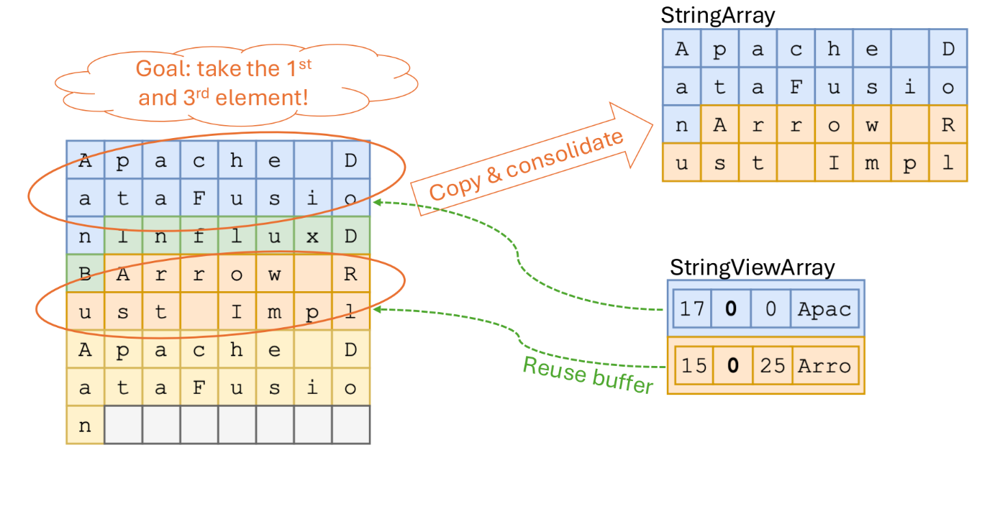

<style>
@import url('https://unpkg.com/tailwindcss@2.2.19/dist/utilities.min.css');
</style>

<!-- mermaid.js -->
<script type="module">
import mermaid from 'https://cdn.jsdelivr.net/npm/mermaid@10.0.0/dist/mermaid.esm.min.mjs';
mermaid.initialize({theme:'neutral'});
</script>

# Using StringView to boost up query speed

<div class="grid grid-cols-3 items-start mt-20">
<div class= "col-span-2">

### A deep dive into implementing **StringView** in Apache Arrow to significantly accelerate string-intensive queries, achieving **20%-200%** performance improvement through careful system optimization.

**@Andy Lok**

</div>
<div>


</div>
</div>

---

<div class="grid grid-cols-2">
<div>

## What is StringView?

</div>
<div>

- 16-byte view structure
- Flexible string representation
  - Short strings (<12 bytes): Inline storage
  - Long strings: Buffer reference + prefix
- Optimized for comparison
- Inspired by [datafusion blog post](https://datafusion.apache.org/blog/2024/09/13/string-view-german-style-strings-part-1/)

</div>
</div>

---

## View Structure

Efficient **memory layout** for string

<div style='margin-top:40px;'>


</div>

---

<div class="grid grid-cols-2">
<div>

## Key Benefits

</div>
<div>

- **Less copying** via offset + buffer format
- **Faster comparisons** using inlined prefixes
- String **deduplication** through flexible layout
- Significant performance gains
  - 20%-200% faster queries
  - 2x faster Parquet loading

</div>
</div>

---

<div class="grid grid-cols-2">
<div>

## Less Copying

No more copying strings from **parquet**

</div>
<div style='margin-left:-50px;'>


</div>
</div>

---

<div class="grid grid-cols-2">
<div>

## Fast Comaprison

Compare with inlined **prefix**

</div>
<div style='margin-left:-150px;'>


</div>
</div>

---

<div class="grid grid-cols-2">
<div>

## Reuse buffer

Faster **take** without consolidate

</div>
<div style='margin-left:-150px;'>



</div>
</div>

---

<div class="grid grid-cols-2">
<div>

## Implementation

</div>
<div>

Core components of `StringView`

```rust
#[repr(C)]
pub struct View {
    /// The length of the string/bytes.
    pub length: u32,
    /// First 4 bytes of string/bytes data.
    pub prefix: u32,
    /// The buffer index.
    pub buffer_idx: u32,
    /// The offset into the buffer.
    pub offset: u32,
}

impl View {
    pub fn as_u128(self) -> u128 {
        unsafe { std::mem::transmute(self) }
    }
}
```

</div>
</div>

---

<div class="grid grid-cols-2">
<div>

## Implementation

</div>
<div>

Core components of `StringView`

```rust
#[repr(C)]
pub struct View {
    /// The length of the string/bytes.
    pub length: u32,
    /// First 4 bytes of string/bytes data.
    pub prefix: u32,
    /// The buffer index.
    pub buffer_idx: u32,
    /// The offset into the buffer.
    pub offset: u32,
}

impl View {
    pub fn as_u128(self) -> u128 {
        unsafe { std::mem::transmute(self) }
    }
}
```

</div>
</div>

---

<div class="grid grid-cols-2">
<div>

## Implementation

</div>
<div>

`Utf8ViewArray` definition in Apache Arrow

```rust
pub struct Utf8ViewArray {
    views: Buffer<View>,
    buffers: Arc<[Buffer<u8>]>,
    validity: Option<Bitmap>,
    // ...
}
```

</div>
</div>

---

<div class="grid grid-cols-2">
<div>

## Implementation

</div>
<div>

`StringColumn` definition in Databend, providing a high-level API

```rust
pub struct StringColumn {
    pub(crate) data: Utf8ViewArray,
}

impl StringColumn {
  pub fn new(data: Utf8ViewArray) -> Self {
        Self { data }
    }

    pub fn len(&self) -> usize {
        self.data.len()
    }

    pub fn index(&self, index: usize) -> Option<&str> {
        // ...
    }

    pub fn iter(&self) -> StringIterator {
        // ...
    }
}
```

</div>
</div>

---

<div class="grid grid-cols-2">
<div>

## Implementation

</div>
<div>

Fast comparison with `StringColumn`

```rust
impl StringColumn {
    pub fn compare(col_i: &Self, i: usize, col_j: &Self, j: usize) -> Ordering {
        let view_i = unsafe { col_i.data.views().as_slice().get_unchecked_release(i) };
        let view_j = unsafe { col_j.data.views().as_slice().get_unchecked_release(j) };

        if view_i.prefix == view_j.prefix {
            unsafe {
                let value_i = col_i.data.value_unchecked(i);
                let value_j = col_j.data.value_unchecked(j);
                value_i.cmp(value_j)
            }
        } else {
            view_i
                .prefix
                .to_le_bytes()
                .cmp(&view_j.prefix.to_le_bytes())
        }
    }
}
```

</div>
</div>

---

## Implementation

Define **builtin functions** for string with fast comparison

<div class="grid grid-cols-2 items-start">
<div>

```rust
fn register_string_cmp(registry: &mut FunctionRegistry) {
    registry.register_passthrough_nullable_2_arg::<StringType, StringType, BooleanType, _, _>(
        "eq",
        |_, d1, d2| d1.domain_eq(d2),
        vectorize_string_cmp(|cmp| cmp == Ordering::Equal),
    );
    registry.register_passthrough_nullable_2_arg::<StringType, StringType, BooleanType, _, _>(
        "noteq",
        |_, d1, d2| d1.domain_noteq(d2),
        vectorize_string_cmp(|cmp| cmp != Ordering::Equal),
    );
    registry.register_passthrough_nullable_2_arg::<StringType, StringType, BooleanType, _, _>(
        "gt",
        |_, d1, d2| d1.domain_gt(d2),
        vectorize_string_cmp(|cmp| cmp == Ordering::Greater),
    );
    registry.register_passthrough_nullable_2_arg::<StringType, StringType, BooleanType, _, _>(
        "gte",
        |_, d1, d2| d1.domain_gte(d2),
        vectorize_string_cmp(|cmp| cmp != Ordering::Less),
    );
    registry.register_passthrough_nullable_2_arg::<StringType, StringType, BooleanType, _, _>(
        "lt",
        |_, d1, d2| d1.domain_lt(d2),
        vectorize_string_cmp(|cmp| cmp == Ordering::Less),
    );
    registry.register_passthrough_nullable_2_arg::<StringType, StringType, BooleanType, _, _>(
        "lte",
        |_, d1, d2| d1.domain_lte(d2),
        vectorize_string_cmp(|cmp| cmp != Ordering::Greater),
    );
}
```

</div>
<div>

```rust
fn vectorize_string_cmp(
    func: impl Fn(Ordering) -> bool + Copy,
) -> impl Fn(ValueRef<StringType>, ValueRef<StringType>, &mut EvalContext) -> Value<BooleanType> + Copy
{
    move |arg1, arg2, _ctx| match (arg1, arg2) {
        (ValueRef::Scalar(arg1), ValueRef::Scalar(arg2)) => Value::Scalar(func(arg1.cmp(arg2))),
        (ValueRef::Column(arg1), ValueRef::Scalar(arg2)) => {
            let mut builder = MutableBitmap::with_capacity(arg1.len());
            for i in 0..arg1.len() {
                builder.push(func(StringColumn::compare_str(&arg1, i, arg2)));
            }
            Value::Column(builder.into())
        }
        (ValueRef::Scalar(arg1), ValueRef::Column(arg2)) => {
            let mut builder = MutableBitmap::with_capacity(arg1.len());
            for i in 0..arg2.len() {
                builder.push(func(StringColumn::compare_str(&arg2, i, arg1).reverse()));
            }
            Value::Column(builder.into())
        }
        (ValueRef::Column(arg1), ValueRef::Column(arg2)) => {
            let mut builder = MutableBitmap::with_capacity(arg1.len());
            for i in 0..arg1.len() {
                builder.push(func(StringColumn::compare(&arg1, i, &arg2, i)));
            }
            Value::Column(builder.into())
        }
    }
}
```

</div>
</div>

---

<div class="grid grid-cols-2">
<div>

## Implementation

</div>
<div>

Build a `StringColumn` with a high-level API

```rust
use databend_common_expression::types::string::StringColumnBuilder;

let mut builder = StringColumnBuilder::with_capacity(100);
for val in &["hello", "world", "arrow"] {
    builder.put_str(val);
    builder.commit_row();
}

let col: StringColumn = builder.build();
```

</div>
</div>

---

## Performance Benchmarks


